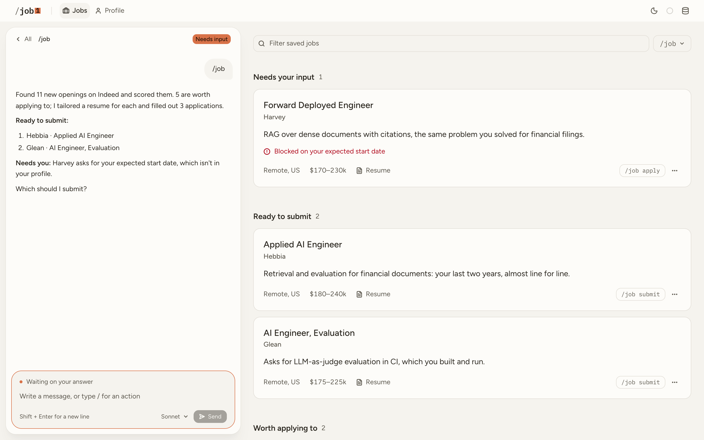

<p align="center">
  <picture>
    <source media="(prefers-color-scheme: dark)" srcset="assets/wordmark-dark.svg">
    
  </picture>
</p>

<p align="center"><strong>The human way to automate job searching</strong></p>

A Claude Code skill that automates the entire job application process, from building your first resume to filling out your last job application. Free and open source. Runs in Claude Code on macOS and Linux.

## How it works

1. **`/job setup`** interviews you and builds your profile. Give it your resume, LinkedIn, GitHub, Blog, Personal Website, or any other source, and it turns all of it into a structured profile.
2. **`/job search`** searches Indeed for new openings, in your own browser, then reads each one against what you want and shortlists the good fits.
3. **`/job resume`** writes a resume for each shortlisted posting from your actual experience.
4. **`/job apply`** fills in the employer's application form, in your own browser and leaves it for you to review and submit.

If all of that is still too much to keep track of, the `/job` command runs everything automatically.

## How it compares

|                                          |  job  | career-ops | ApplyPilot |
| ---------------------------------------- | :---: | :--------: | :--------: |
| Finds, scores, and tailors               |   ✅   |     ✅      |     ✅      |
| Fills the application                     |   ✅   |     ❌      |     ✅      |
| Searches in your browser, like a person  |   ✅   |     ❌      |     ❌      |
| You submit every application             |   ✅   |     ➖      |     ❌      |
| Screening answers only from your profile |   ✅   |     ➖      |     ❌      |
| Leaves captchas to a human               |   ✅   |     ➖      |     ❌      |
| No API key                               |   ✅   |     ✅      |     ❌      |

## The dashboard

<picture>
  <source media="(prefers-color-scheme: dark)" srcset="assets/dashboard-jobs-dark.png">
  
</picture>

Prefer a UI to a Terminal? The job dashboard is a local web app built on top of the skill.

- **No commands to type.** Every action is a button next to the job it applies to.
- **Sorted by what it needs from you.** Each opening shows why it scored the way it did, next to the
  resume written for it.
- **A profile you edit in place.** Anything an application will ask for that you haven't answered
  is flagged before it blocks one.
- **Runs on your machine.** No account, no server. It reads the same database the skill writes.

The dashboard is in private access. [Request access](https://github.com/FayZ676/job-hunt-dashboard).

## Getting started

```
git clone https://github.com/FayZ676/job-hunt-plugin.git ~/.claude/skills/job
cd ~/.claude/skills/job && npm install
```

Then run `/job setup` in Claude Code. Setup is a conversation: point it at your resume, LinkedIn
profile, or GitHub, it drafts your profile, and you correct what it got wrong.

You'll need Node 22.18+, a Chrome-family browser, and for resumes,
[Typst](https://github.com/typst/typst#installation) and Poppler. Setup checks for them and installs
what's missing.
## Questions

**Where does my data go?**
It stays on your machine, in one SQLite file under `~/data/job/`.

**What if it keeps showing me the wrong jobs?**
Tell it what's off with `/job feedback`, in plain words. `/job help` lists every command.

**What does it cost?**
The code is MIT licensed. It runs on the Claude Code plan you already pay for.

**Does it work on Windows?**
It hasn't been tested there. If Chrome isn't found, set `JOB_BROWSER_PATH` to its `.exe`, and please
open an issue with whatever else breaks.

## Disclaimer

`job` runs locally and isn't a hosted service. What you approve is yours, and so is following the
terms of the sites it visits.

## License

MIT
